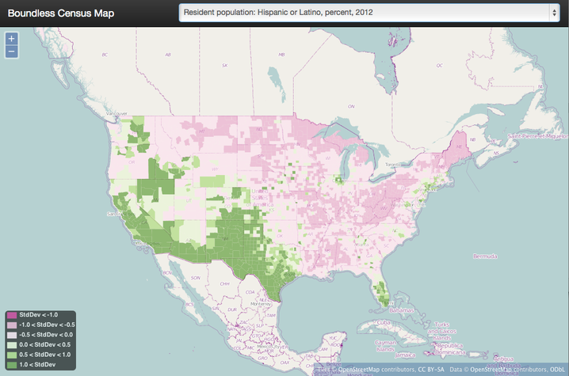
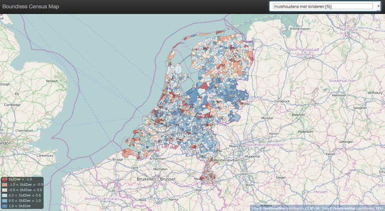

## Introduction

For this adventure in map building, we use the following tools, which if you are following along you will want to install now:

- OpenGeo Suite 4 (available for Linux, Mac OSX and Windows, follow the [Suite installation instructions](http://suite.opengeo.org/opengeo-docs/installation/index.html))

The basic structure of the application will be

- A spatial table of counties in PostGIS, that will join with
- An attribute table with many census variables of interest, themed by
- A thematic style in GeoServer, browsed with
- A simple pane-based application in OpenLayers, allowing the user to choose the census variable of interest.

This application exercises all the tiers of the OpenGeo Suite!

## Getting the Data

In order to keep things simple, we will use a geographic unit that is large enough to be visible on a country-wide map, but small enough to provide a granular view of the data: a district (or wijk in Dutch).
There are about 3000 districts in the Netherlands, enough to provide a detailed view at the national level, but not so many to slow down our mapping engine.

### The Data

For this workshop we will be using the dataset [Wijk- en Buurtkaart 2013](http://www.nationaalgeoregister.nl/geonetwork/srv/dut/search#|71c56abd-87e8-4836-b732-98d73c73c112
). Which is a dataset that contains all the geometries of all municipalities, districts and neighbourhoods in the Netherlands, and its attribute is a number of statiscal key figures.

- Download the [dataset](http://www.cbs.nl/nl-NL/menu/themas/dossiers/nederland-regionaal/links/2013-buurtkaart-shape-versie-1-el.htm).
- Unzip the file
- You will only need `wijk_2013_v1.shp`

## Loading the Data

> **Note**
>
> The next steps will involve some database work.
>
>- If you haven’t already installed the OpenGeo Suite, follow the [Suite installation instructions](http://suite.opengeo.org/opengeo-docs/installation/index.html).
>- [Create a spatial database](http://suite.opengeo.org/opengeo-docs/dataadmin/pgGettingStarted/createdb.html) named wijken to load data into.

### Loading the Shapefile

Loading the `wijk_2013_v1.shp` file is pretty easy, either using the command line or the shape loader GUI. Just remember that our target table name is counties. Here’s the command-line:

<pre><code class="bash">shp2pgsql -I -s 28992 -W "LATIN1" wijk_2013_v1.shp wijken | psql wijken</code></pre>

And this is what the GUI looks like:

Note that, that the shapefile contains a number of attributes

## Drawing the Map
Our challenge now is to set up a rendering system that can easily render any of our 59 columns of census data as a map.

We could define 59 layers in GeoServer, and set up 59 separate styles to provide attractive renderings of each variable. But that would be a lot of work, and we’re much too lazy to do that. What we want is a single layer that can be re-used to render any column of interest.

### One Layer to Rule them All

Using a [parametric SQL](http://docs.geoserver.org/stable/en/user/data/database/sqlview.html#using-a-parametric-sql-view) view we can define a SQL-based layer definition that allows us to change the column of interest by substituting a variable when making a WMS map rendering call.

For example, this SQL definition will allow us to substitute any column we want into the map rendering chain:

<pre><code class="sql">SELECT wk_code, wk_naam, gm_code, gm_naam, water, %column% AS data
    FROM wijken;</code></pre>

### Preparing the Data

According to the [documentation](http://download.cbs.nl/regionale-kaarten/toelichting-buurtkaart-2013-v1.pdf) the NoData values of the Wijken en Buurten dataset are set to -99999997, -99999998 and -99999999. To make sure that these are correctly displayed , these values need to be set to NULL.

<pre><code class="sql">DO $$
DECLARE
   col_names CURSOR FOR  SELECT column_name as cn, data_type as dt
      from information_schema.columns
      where table_name='wijken';
BEGIN

   FOR col_name_row IN col_names LOOP
      IF  col_name_row.cn not in ('wk_code','wk_naam','gm_code','gm_naam','water', 'geom' ) THEN
         RAISE NOTICE 'Updating column %', col_name_row.cn;
         EXECUTE format ('UPDATE wijken SET %I=null WHERE CAST(%I AS int) in (-99999997,-99999998,-99999999)', col_name_row.cn, col_name_row.cn);
      END IF;
   END LOOP;
END$$;</code></pre>

### One Style to Rule them All

Viewing our data via a parametric SQL view doesn’t quite get us over the goal line though, because we still need to create a thematic style for the data, and the data in our 51 columns have vastly different ranges and distributions:

- some are percentages
- some are absolute population counts
- some are medians or averages of absolutes

We need to somehow get all this different data onto one scale, preferably one that provides for easy visual comparisons between variables.

The answer is to use the average and standard deviation of the data to normalize it to a standard scale

For example:

- For data set D, suppose the avg(D) is 10 and the stddev(D) is 5.
- What will the average and standard deviation of (D - 10) / 5 be?
- The average will be 0 and the standard deviation will be 1.

Let’s try it on our own census data.

<pre><code class="sql">SELECT Avg(pst045212), Stddev(pst045212) FROM census;

--
--        avg        |     stddev
-- ------------------+-----------------
--  99877.2001272669 | 319578.62862369

SELECT Avg((pst045212 - 99877.2001272669) / 319578.62862369),
       Stddev((pst045212 - 99877.2001272669) / 319578.62862369)
FROM census;

--     avg    | stddev
-- -----------+--------
--      0     |      1</code></pre>

So we can easily convert any of our data into a scale that centers on 0 and where one standard deviation equals one unit just by normalizing the data with the average and standard deviation!

Our new parametric SQL view will look like this:

## Building the App

### Preparing the Metadata

The first thing we need for our app is a data file that maps the short, meaningless column names in our census table to human readable information. Fortunately, the [dictionary.txt](data/dictionary.txt) file has all the information we need. Here’s a couple example lines:

    P_HH_M_K: Huishoudens met kinderen [%]
    GEM_HH_GR: Gemiddelde huishoudensgrootte [absoluut]
    P_WEST_AL: Westers totaal [%]

Each line has the column name and a human readable description. Fortunately the information is nicely seperated by a colon in the text file, so the fields can be extracted by using a `split()` function.

We’re going to consume this information in a JavaScript web application. The text file can easily be read in and split into lines. Each line can be split into an array with at position 0 the attribute code and at position 1 the attribute description to populate a topics dropdown.

### Framing the Map

We already saw our map visualized in a bare [OpenLayers](http://ol3js.org/) map frame in the Layer Preview section of GeoServer.

We want an application that provides a user interface component that manipulates the source WMS URL, altering the URL [viewparams](http://docs.geoserver.org/stable/en/user/data/database/sqlview.html#using-a-parametric-sql-view) parameter.

We’ll build the app using [Bootstrap](http://getbootstrap.com/) for a straightforward layout with CSS, and [OpenLayers](http://ol3js.org/) as the map component.

The base HTML page, [index.html](code/index.html), contains script and stylesheet includes bringing in our various libraries. A custom stylesheet gives us a fullscreen map with a legend overlay. Bootstrap css classes are used to style the navigation bar. Containers for the map and a header navigation bar with the aforementioned topics dropdown are also included, and an image element with the legend image from a WMS *GetLegendGraphic* request is put inside the map container.

<pre><CODE>&lt;!DOCTYPE html&gt;
&lt;html&gt;
  &lt;head&gt;
    &lt;title&gt;Boundless Census Map&lt;/title&gt;
    &lt;!-- Bootstrap --&gt;
    &lt;link rel=&quot;stylesheet&quot; href=&quot;resources/bootstrap/css/bootstrap.min.css&quot; type=&quot;text/css&quot;&gt;
    &lt;link rel=&quot;stylesheet&quot; href=&quot;resources/bootstrap/css/bootstrap-theme.min.css&quot; type=&quot;text/css&quot;&gt;
    &lt;script src=&quot;resources/jquery-1.10.2.min.js&quot;&gt;&lt;/script&gt;
    &lt;script src=&quot;resources/bootstrap/js/bootstrap.min.js&quot;&gt;&lt;/script&gt;
    &lt;!-- OpenLayers --&gt;
    &lt;link rel=&quot;stylesheet&quot; href=&quot;resources/ol3/ol.css&quot;&gt;
    &lt;script src=&quot;resources/ol3/ol.js&quot;&gt;&lt;/script&gt;
    &lt;!-- Our Application --&gt;
    &lt;style&gt;
      html, body, #map {
        height: 100%;
      }
      #map {
        padding-top: 50px;
      }
      .legend {
        position: absolute;
        z-index: 1;
        left: 10px;
        bottom: 10px;
        opacity: 0.6;
      }
    &lt;/style&gt;
  &lt;/head&gt;
  &lt;body&gt;
    &lt;nav class=&quot;navbar navbar-inverse navbar-fixed-top&quot; role=&quot;navigation&quot;&gt;
      &lt;div class=&quot;navbar-header&quot;&gt;
        &lt;a class=&quot;navbar-brand&quot; href=&quot;#&quot;&gt;Boundless Census Map&lt;/a&gt;
      &lt;/div&gt;
      &lt;form class=&quot;navbar-form navbar-right&quot;&gt;
        &lt;div class=&quot;form-group&quot;&gt;
          &lt;select id=&quot;topics&quot; class=&quot;form-control&quot;&gt;&lt;/select&gt;
        &lt;/div&gt;
      &lt;/form&gt;
    &lt;/nav&gt;
    &lt;div id=&quot;map&quot;&gt;
      &lt;!-- GetLegendGraphic, customized with some LEGEND_OPTIONS --&gt;
      &lt;img class=&quot;legend img-rounded&quot; src=&quot;https://workshop-boundless-geocat.geocat.net/geoserver/it.geosolutions/wms?REQUEST=GetLegendGraphic&VERSION=1.3.0&FORMAT=image/png&WIDTH=26&HEIGHT=18&STRICT=false&LAYER=normalized&LEGEND_OPTIONS=fontName:sans-serif;fontSize:11;fontAntiAliasing:true;fontStyle:normal;fontColor:0xFFFFFF;bgColor:0x000000quot;&gt;
    &lt;/div&gt;
    &lt;script type=&quot;text/javascript&quot; src=&quot;censusmap.js&quot;&gt;&lt;/script&gt;
  &lt;/body&gt;
&lt;/html&gt;</CODE></pre>

The real code is in the [censusmap.js](code/censusmap.js) file. We start by creating an [OpenStreetMap](http://openstreetmap.org/) base layer, and adding our parameterized census layer on top as an image layer with a [WMS Layer source](http://ol3js.org/en/master/apidoc/ol.source.ImageWMS.html).

<pre><code class="js">// Base map
var osmLayer = new ol.layer.Tile({source: new ol.source.OSM()});

// Census map layer
var wmsLayer = new ol.layer.Image({
  source: new ol.source.ImageWMS({
    url: 'https://workshop-boundless-geocat.geocat.net/geoserver/it.geosolutions/wms?',
    params: {'LAYERS': 'normalized'}
  }),
  opacity: 0.6
});

// Map object
olMap = new ol.Map({
  target: 'map',
  renderer: ol.RendererHint.CANVAS,
  layers: [osmLayer, wmsLayer],
  view: new ol.View2D({
    center: [548488.744033247, 6776044.612217913],
    zoom: 7
  })
});</code>
</pre>

We configure an [OpenLayers Map](http://ol3js.org/en/master/apidoc/ol.Map.html), assign the layers, and give it a map view with a center and zoom level. Now the map will load.

The select element with the id topics will be our drop-down list of available columns. We load the [dictionary.txt](data/dictionary.txt) file, and fill the select element with its contents. This is done by adding an option child for each line.

<pre><code class="highlight-javascript">// Load variables into dropdown
$.get("../data/dictionary.txt", function(response) {
  // We start at line 3 - line 1 is column names, line 2 is not a variable
  $(response.split('\n')).each(function(index, line) {
    $('#topics').append($("&lt;option&gt;")
      .val(line.split(":")[0].trim())
      .html(line.split(":")[1].trim()));
  });
});</code></pre>

<pre><code class="javascript">// Add behaviour to dropdown
$('#topics').change(function() {
  wmsLayer.getSource().updateParams({
    'viewparams': 'column:' + $('#topics>option:selected').val()
  });
});</code></pre>

Look at the the [censusmap.js](code/censusmap.js) file to see the whole application in one page.

When we open the [index.html](code/index.html) file, we see the application in action.

## Conclusion

We’ve built an application for browsing 51 different census variables, using less than 51 lines of JavaScript application code, and demonstrating:
- SQL views provide a powerful means of manipulating data on the fly.
- Standard deviations make for attractive visualization breaks.
- Professionally generated color palettes are better than programmer generated ones.
- Simple OpenLayers applications are easy to build.
- Census data can be really, really interesting!
- The application is easy to extend. With 20 more lines of code we can handle clicks and display feature information.
